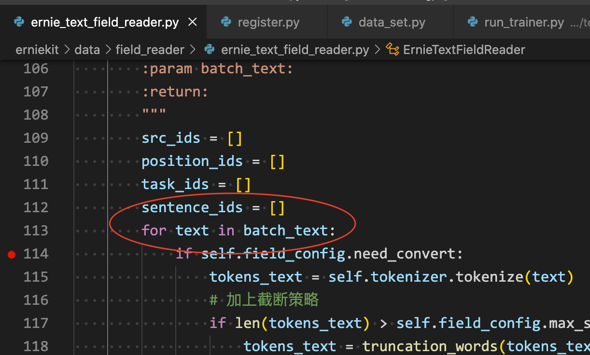
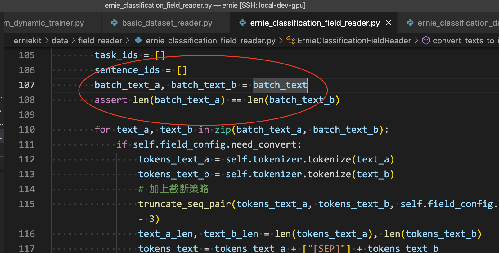

erine 代码笔记

- 方法通过配置文件json，动态载入到config或者params字典中。因此要找到调用对应关系，就从配置的json中入手。
- fulltokenizer 位于tokenzier/tokenization_wp.py中，这个目录中每个tokenizer的类名都不同。

text\_classification, 没有text\_b:

run\_trainer -> custom\_dynamic\_trainer -> basic\_dataset\_reader -> convert\_fields\_to\_dict

-\> filed.field\_reader.structure\_fields\_dict \[ernie\_text\_field\_reader\]

text\_match, 有text\_b:

run\_trainer -> custom\_dynamic\_trainer -> ernie\_classification\_dataset\_reader(继承自basic\_dataset\_reader -> convert\_fields\_to_dict

-\> filed.field\_reader.structure\_fields\_dict \[ernie\_classification\_field\_reader\]

